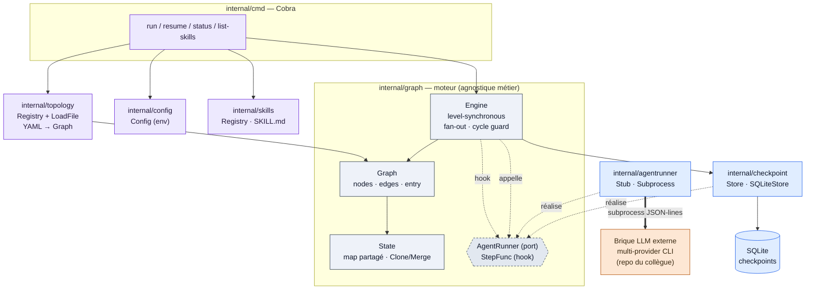
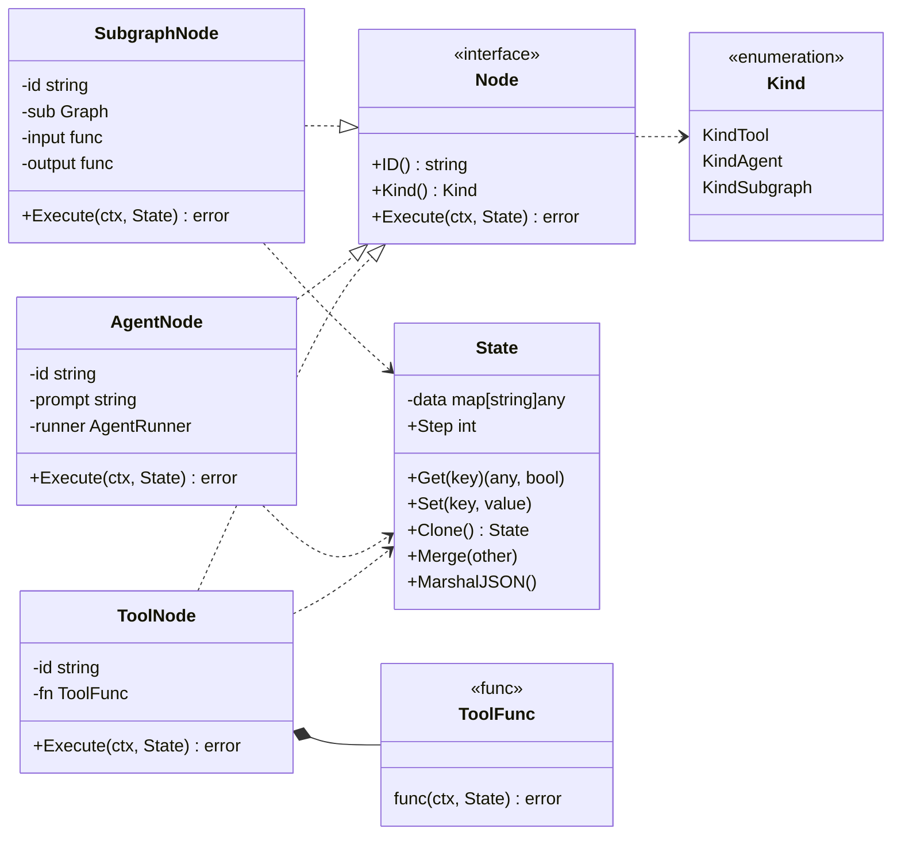
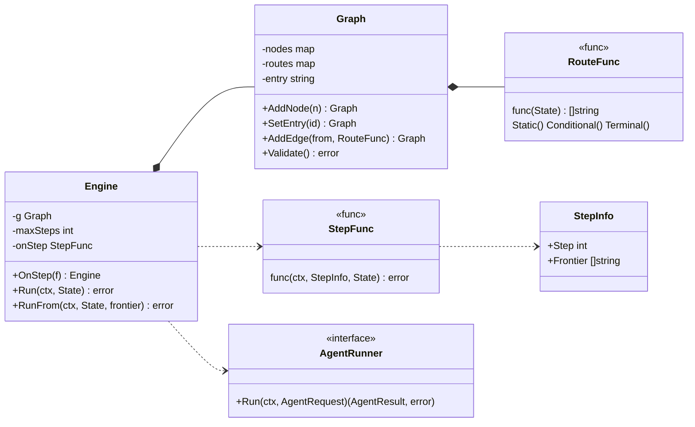
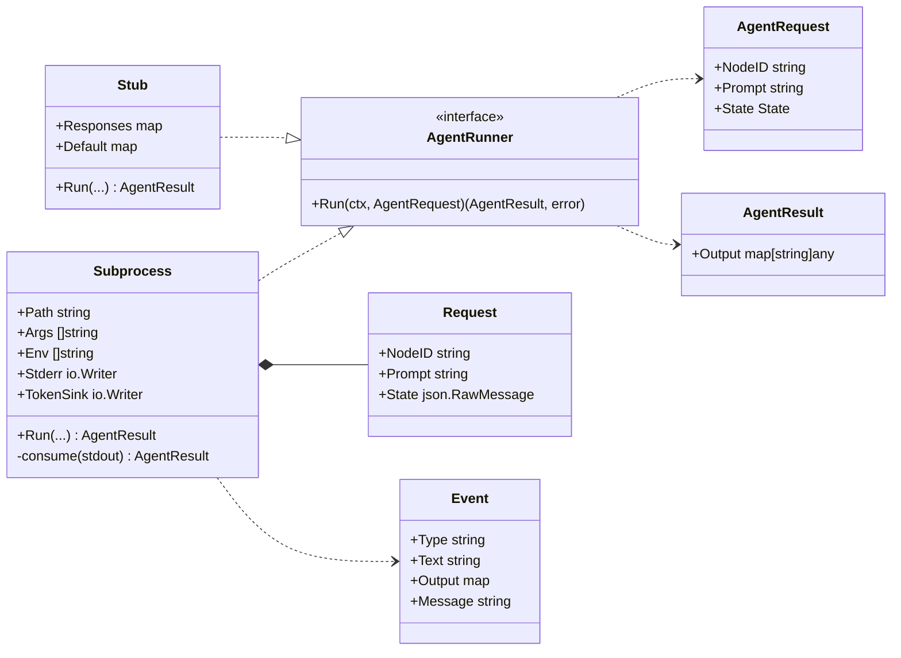
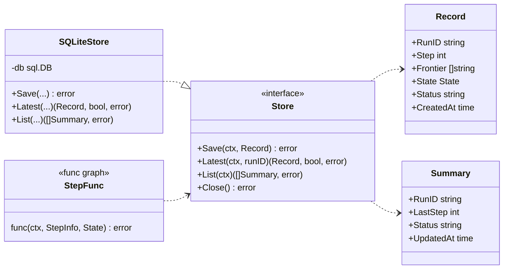
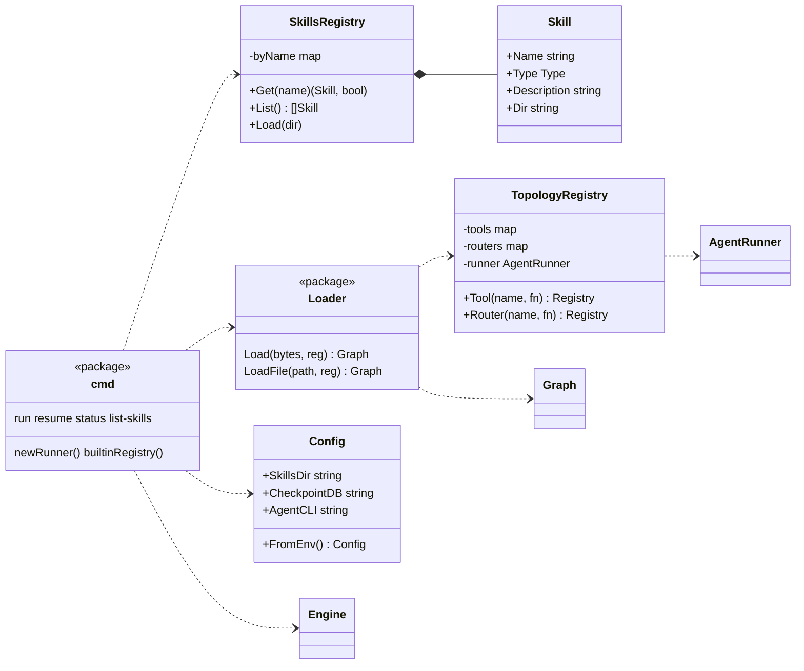

# Kern-Orch — Architecture & diagrammes de classe

> Harnais agentique (Go 1.26) — v0.2.0. Un orchestrateur qui exécute un graphe explicite
> d'agents et de sous-agents (state partagé, nœuds, edges, checkpoints). Il ne parle jamais
> au LLM directement : il l'invoque en subprocess pour chaque nœud `agent`.

**Stack** : Go 1.26 · Cobra · `modernc.org/sqlite` (no cgo) · `yaml.v3` · 7 packages `internal/`.

**Conventions des diagrammes de classe** : `..|>` réalise (implements) · `*--` possède ·
`..>` utilise/dépend.

**Direction des dépendances** : `graph` définit les *ports* (`AgentRunner`, `StepFunc`) ;
l'infra (`agentrunner`, `checkpoint`) dépend de `graph`, **jamais l'inverse**.

---

## 1. Architecture & flux d'exécution

- **Le harnais gouverne, le LLM exécute** : le routage est Go-pur ; un nœud `agent` appelle
  la CLI externe et fusionne sa sortie, mais c'est le moteur qui décide la suite.
- **Agnostique** : rien de métier dans `internal/graph`. La valeur métier entre par les
  **skills**, les **tool funcs** (registry Go) et le **graphe YAML**.

---

## 2. Cœur : `State` & `Node` (internal/graph 1/2)

L'unité de travail. `Node` mute le state en place et *ne choisit jamais* le nœud suivant
(le routage est la responsabilité du moteur). Trois implémentations selon `Kind`.

- `SubgraphNode` = le **sous-agent** (§3) : exécute un `Graph` enfant avec son propre state
  (seedé du parent via `input`, remonté via `output`).
- `State.Clone()` isole une branche de fan-out ; `Merge()` remonte le résultat.

---

## 3. Moteur : `Graph`, `Engine` & routage (internal/graph 2/2)

Le `Graph` possède les nœuds et une `RouteFunc` par nœud (routage Go-pur). L'`Engine`
exécute par niveaux, en parallèle, et expose le hook `StepFunc` — la couture de
persistance, sans que `graph` connaisse `checkpoint`.

- **Ordonnancement level-synchronous** : chaque frontière tourne en parallèle sur des clones
  du state, merge stable, frontière suivante dédupliquée — testé sous `-race`.
- `RunFrom` généralise `Run` (entry = frontière initiale) et sert la reprise depuis un checkpoint.

---

## 4. Runner d'agent : le port vers le LLM (internal/agentrunner)

Deux implémentations du port `graph.AgentRunner` : `Stub` déterministe (l'app tourne sans
aucune config LLM) et `Subprocess` qui parle un protocole *JSON-lines* à la CLI externe
(contrat §6.4 **provisoire**).

- **Contrat provisoire** : 1 `Request` sur stdin, des `Event` `{token · result · error}` par
  ligne sur stdout ; à réconcilier avec la vraie CLI.
- Sélection au runtime : `Subprocess` si `KERN_AGENT_CLI` est défini, sinon `Stub`.

---

## 5. Persistance & reprise (internal/checkpoint)

Le state est persisté par niveau. L'`Engine` appelle `Store.Save` via son hook `StepFunc` ;
`resume` recharge le dernier checkpoint et relance `Engine.RunFrom`.

- Clé `(run_id, step)`, upsert idempotent ; un `SubgraphNode` est **un step atomique** côté
  parent (granularité §6.3).
- SQLite pur Go (`modernc.org/sqlite`, no cgo).

---

## 6. Câblage : catalogue, chargement, CLI (skills · topology · config · cmd)

Le YAML déclare la topologie ; les fonctions `tool`/`router` sont du Go enregistré par nom
dans `topology.Registry` (modèle hybride §6.1). `skills.Registry` lit le `type` des `SKILL.md`.

- `LoadFile` résout `type: subgraph` (fichiers imbriqués) avec garde anti-récursion ;
  `Load([]byte)` refuse les subgraphs.
- Un `type: tool` dans un SKILL.md reste une **étiquette de catalogue** — l'exécution passe
  encore par une func Go du registry (lien non encore fusionné).

---

## Reste ouvert

Réconciliation du contrat JSON-lines **§6.4** avec la CLI multi-provider du collègue —
isolée derrière le port `AgentRunner`, donc l'impact se limitera à
`internal/agentrunner/{protocol,subprocess}.go`.
