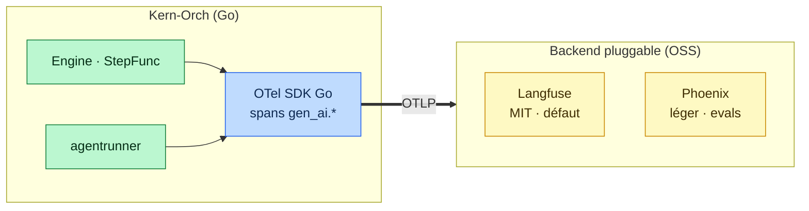

# Observabilité — état de l'art & décision (EPIC-11)

> Question de départ : *LangSmith est-il une piste pour l'observabilité ? On gère ça en Go ?*
> Réponse courte : **non à LangSmith comme socle** (propriétaire, non souverain, Python/JS-first) ;
> **oui on gère en Go**, mais via **OpenTelemetry (conventions GenAI)** + un **backend open source
> pluggable**, pas en réécrivant une plateforme. État de l'art ci-dessous. — 2026-07-22.

## Le constat structurant

Aucun produit d'observabilité LLM/agent n'a de **SDK Go natif de premier plan** — ils sont tous
Python/JS-first. **Le seul chemin universel pour un CORE Go, c'est OpenTelemetry** : on émet des
spans avec les **conventions sémantiques GenAI** (`gen_ai.*`), on exporte en **OTLP**, et n'importe
quel backend compatible les ingère. On s'instrumente **une fois**, on change de backend **sans
ré-instrumenter**.

⚠️ Les conventions GenAI d'OTel sont encore en statut **« Development »** (spec v1.41, avril 2026) :
spans `agent`/`workflow`/`tool`/`model` + métriques tokens/latence définis, mais les noms
d'attributs peuvent changer sans bump majeur. → **épingler une version**, isoler le mapping.

## Comparatif open source (2026)

| Outil | Licence | Self-host | Story Go | Empreinte | Evals | Note |
|---|---|---|---|---|---|---|
| **OpenTelemetry GenAI** (semconv + SDK) | Apache-2.0 | n/a (standard) | ✅ SDK Go 1st-class | — | non | **couche neutre** ; attributs « Development » |
| **Langfuse** | MIT (racheté par ClickHouse, ~29k★) | ✅ gratuit, illimité | 🟡 via OTLP (pas de SDK Go officiel ; SDK communautaire) | lourd (Postgres + ClickHouse + Redis + S3) | ✅ | ingest OTLP sur `/api/public/otel` ; plateforme complète (prompts, evals) |
| **Arize Phoenix** | Elastic License 2.0 (source-available, pas OSI) | ✅ 1 seul process | 🟡 via OTLP / OpenInference | légère | ✅ agent-native | le plus léger à opérer ; pas OSI strict |
| **OpenLLMetry** (Traceloop) | Apache-2.0 | ✅ (émetteur) | 🟡 instrumentations Py/JS ; Go = OTel manuel | — | non | route vers n'importe quel backend OTLP |
| **Helicone** | Apache-2.0 | ✅ | agnostique (proxy LLM) | moyenne | partiel | intercepte au niveau proxy — pertinent au point kern-link |
| **SigNoz / OpenObserve** | Apache-2.0 / AGPL-ish | ✅ | ✅ via OTLP | moyenne/légère | non | backends OTel généralistes (traces/logs/métriques) |
| **LangSmith** | **propriétaire** (closed) | ❌ Enterprise only | SDK Py/JS | SaaS | ✅ | ~2 514 $/mo à 1M events vs ~101 $ Langfuse ; **écarté** |

## Recommandation pour Kern-Orch

**Ne pas réécrire de plateforme d'observabilité, ne pas se lier à un vendeur.**

1. **Instrumenter le harnais en Go avec OpenTelemetry** (SDK OTel Go), en conventions GenAI.
   Les points d'émission existent déjà :
   - le hook **`Engine.StepFunc`** → un span par niveau/nœud (déjà la couture de persistance) ;
   - **`agentrunner`** → un span `gen_ai` par appel LLM (prompt, tokens, latence, provider) ;
   - un span racine par run (le `runID` des checkpoints devient le `trace_id`).
2. **Exporter en OTLP**, backend **pluggable via env** (comme `KERN_AGENT_CLI` / `KERN_CHECKPOINT_DB`) :
   - **défaut souverain : Langfuse self-host** (MIT, OTLP natif) ;
   - **alternative légère : Arize Phoenix** (1 process, evals agent) ;
   - **ou rien** : pas d'endpoint configuré → no-op (l'app tourne, comme le Stub LLM).
3. **Ne dépendre d'aucun de ces backends dans le code** : on ne connaît qu'OTLP + `gen_ai.*`.

### Où ça branche l'EPIC-11 « déclaré vs observé »
- **observé** = la trace OTel réelle du run (spans nœuds + appels LLM).
- **déclaré** = la topologie du graphe (le plan attendu, déjà en mémoire).
- **Analyseur** = comparer les deux → c'est **notre valeur ajoutée** ; OTel/Langfuse ne fait
  que fournir le substrat (collecte, stockage, UI, evals). Le **Watcher temps réel** = un
  exporter/reader sur le flux de spans.

**Bilan** : OTel + Langfuse (ou Phoenix) remplacent le gros du travail « plomberie » d'EPIC-11
(collecte, stockage, UI, métriques, evals). Reste à écrire : l'instrumentation Go (S–M) et
l'analyseur déclaré-vs-observé (M–L), pas une plateforme.

## Sources
- [Best AI Agent Observability Tools 2026 — Latitude](https://latitude.so/blog/best-ai-agent-observability-tools-2026-comparison)
- [AI Agent Observability: Open Source & OTel Compared — Morph](https://www.morphllm.com/ai-agent-observability-tools)
- [Arize Phoenix vs Langfuse (2026) — Morph](https://www.morphllm.com/comparisons/arize-phoenix-vs-langfuse)
- [Langfuse vs LangSmith (self-host, lock-in, pricing) — Morph](https://www.morphllm.com/comparisons/langfuse-vs-langsmith)
- [LangSmith Alternatives (open source, self-host) — Morph](https://www.morphllm.com/comparisons/langsmith-alternatives)
- [OpenTelemetry (OTLP) for LLM Observability — Langfuse docs](https://langfuse.com/integrations/native/opentelemetry)
- [Does Langfuse SDK support Golang? — Langfuse GitHub Discussion #7436](https://github.com/orgs/langfuse/discussions/7436)
- [opentelemetry-langfuse (intégration OTel) — GitHub](https://github.com/genai-rs/opentelemetry-langfuse)
- [OpenTelemetry GenAI Semantic Conventions in Production (2026) — VeraExMachina](https://veraexmachina.com/tech/opentelemetry-genai-agent-observability-production/)
- [OpenTelemetry GenAI Agent SemConv Cheat Sheet 2026 — TechBytes](https://techbytes.app/posts/opentelemetry-genai-agent-semconv-cheat-sheet-2026/)
- [LLM Observability Tools 2026 — SigNoz](https://signoz.io/comparisons/llm-observability-tools/)
