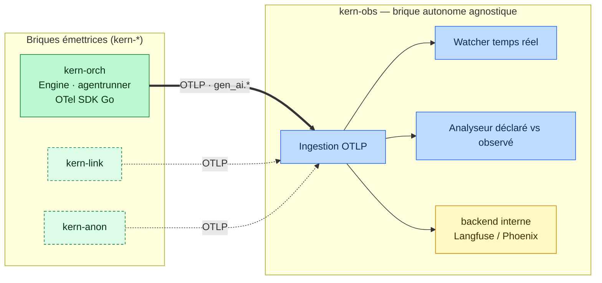

# Observabilité — état de l'art & décision (kern-obs)

> Question de départ : *LangSmith est-il une piste pour l'observabilité ? On gère ça en Go ?*
> Réponse courte : **non à LangSmith comme socle** (propriétaire, non souverain, Python/JS-first) ;
> **oui on gère en interne**, sous forme d'une **brique autonome `kern-obs`, agnostique**, séparée
> de kern-orch. La frontière entre les deux = **OpenTelemetry (conventions GenAI) sur OTLP**.
> État de l'art ci-dessous. — 2026-07-22.

## Principe : kern-obs est une brique à part entière

Comme kern-orch, kern-anon et kern-link, **kern-obs est un module `kern-*` autonome**. Il est
**agnostique de qui l'émet** : il observe **n'importe quelle** brique qui émet des spans OTel/GenAI,
pas seulement kern-orch.

- **kern-orch** ne fait qu'**émettre** de la télémétrie OTLP → **zéro dépendance vers kern-obs**.
- **kern-obs** **ingère** l'OTLP, stocke, surveille (Watcher) et analyse (« déclaré vs observé »).
  Il peut **embarquer en interne** un backend OSS (Langfuse/Phoenix) — c'est un détail
  d'implémentation de kern-obs, invisible des autres briques.
- La seule chose partagée entre briques : le **contrat OTLP + conventions `gen_ai.*`**.

## Le constat structurant

Aucun produit d'observabilité LLM/agent n'a de **SDK Go natif de premier plan** — ils sont tous
Python/JS-first. **Le seul chemin universel pour un CORE Go, c'est OpenTelemetry** : on émet des
spans avec les **conventions sémantiques GenAI** (`gen_ai.*`), on exporte en **OTLP**, et n'importe
quel backend compatible les ingère. On s'instrumente **une fois**, on change de backend **sans
ré-instrumenter**.

⚠️ Les conventions GenAI d'OTel sont encore en statut **« Development »** (spec v1.41, avril 2026) :
spans `agent`/`workflow`/`tool`/`model` + métriques tokens/latence définis, mais les noms
d'attributs peuvent changer sans bump majeur. → **épingler une version**, isoler le mapping.

## Comparatif open source (2026)

| Outil | Licence | Self-host | Story Go | Empreinte | Evals | Note |
|---|---|---|---|---|---|---|
| **OpenTelemetry GenAI** (semconv + SDK) | Apache-2.0 | n/a (standard) | ✅ SDK Go 1st-class | — | non | **couche neutre** ; attributs « Development » |
| **Langfuse** | MIT (racheté par ClickHouse, ~29k★) | ✅ gratuit, illimité | 🟡 via OTLP (pas de SDK Go officiel ; SDK communautaire) | lourd (Postgres + ClickHouse + Redis + S3) | ✅ | ingest OTLP sur `/api/public/otel` ; plateforme complète (prompts, evals) |
| **Arize Phoenix** | Elastic License 2.0 (source-available, pas OSI) | ✅ 1 seul process | 🟡 via OTLP / OpenInference | légère | ✅ agent-native | le plus léger à opérer ; pas OSI strict |
| **OpenLLMetry** (Traceloop) | Apache-2.0 | ✅ (émetteur) | 🟡 instrumentations Py/JS ; Go = OTel manuel | — | non | route vers n'importe quel backend OTLP |
| **Helicone** | Apache-2.0 | ✅ | agnostique (proxy LLM) | moyenne | partiel | intercepte au niveau proxy — pertinent au point kern-link |
| **SigNoz / OpenObserve** | Apache-2.0 / AGPL-ish | ✅ | ✅ via OTLP | moyenne/légère | non | backends OTel généralistes (traces/logs/métriques) |
| **LangSmith** | **propriétaire** (closed) | ❌ Enterprise only | SDK Py/JS | SaaS | ✅ | ~2 514 $/mo à 1M events vs ~101 $ Langfuse ; **écarté** |

## Recommandation : deux moitiés, une frontière OTLP

**Ne pas réécrire de plateforme, ne pas se lier à un vendeur — et surtout ne pas mettre
l'observabilité *dans* kern-orch.** On sépare nettement l'**émission** (kern-orch) de la
**brique d'observabilité** (kern-obs).

### Côté kern-orch — juste émettre (fin, dans ce repo)
1. **Instrumenter en Go avec OpenTelemetry** (SDK OTel Go), conventions GenAI. Points d'émission
   déjà présents :
   - hook **`Engine.StepFunc`** → un span par niveau/nœud (déjà la couture de persistance) ;
   - **`agentrunner`** → un span `gen_ai` par appel LLM (prompt, tokens, latence, provider) ;
   - span racine par run (le `runID` des checkpoints devient le `trace_id`) ;
   - **plan déclaré** émis comme attributs (nœuds/edges attendus).
2. **Exporter en OTLP**, endpoint **pluggable via env** (comme `KERN_AGENT_CLI` / `KERN_CHECKPOINT_DB`) ;
   pas d'endpoint → **no-op** (l'app tourne, comme le Stub LLM).
3. **Aucune dépendance** vers kern-obs ni vers un backend : on ne connaît qu'OTLP + `gen_ai.*`.

### Brique kern-obs — ingérer, surveiller, analyser (module à part)
Agnostique : consomme l'OTLP de **toute** brique `kern-*`. Peut **embarquer** Langfuse (MIT,
souverain, défaut) ou Phoenix (léger, evals) **en interne** — invisible du reste.

### « Déclaré vs observé » sans casser l'agnosticité
- **observé** = la trace OTel réelle du run (spans nœuds + appels LLM).
- **déclaré** = le plan **émis en télémétrie** par kern-orch (attributs nœuds/edges attendus) —
  donc kern-obs le lit **dans les spans**, sans jamais toucher au code de kern-orch.
- **Analyseur** = comparer les deux → **valeur ajoutée de kern-obs**. Un backend OSS ne fournit
  que le substrat (collecte, stockage, UI, evals).

**Bilan** : OTel + un backend embarqué remplacent la plomberie (collecte, stockage, UI, evals).
Reste à écrire — répartis sur **deux repos** : l'émission Go côté kern-orch (S–M), et la brique
kern-obs (ingestion + watcher + analyseur, M–L). Pas une plateforme from scratch.

## Sources
- [Best AI Agent Observability Tools 2026 — Latitude](https://latitude.so/blog/best-ai-agent-observability-tools-2026-comparison)
- [AI Agent Observability: Open Source & OTel Compared — Morph](https://www.morphllm.com/ai-agent-observability-tools)
- [Arize Phoenix vs Langfuse (2026) — Morph](https://www.morphllm.com/comparisons/arize-phoenix-vs-langfuse)
- [Langfuse vs LangSmith (self-host, lock-in, pricing) — Morph](https://www.morphllm.com/comparisons/langfuse-vs-langsmith)
- [LangSmith Alternatives (open source, self-host) — Morph](https://www.morphllm.com/comparisons/langsmith-alternatives)
- [OpenTelemetry (OTLP) for LLM Observability — Langfuse docs](https://langfuse.com/integrations/native/opentelemetry)
- [Does Langfuse SDK support Golang? — Langfuse GitHub Discussion #7436](https://github.com/orgs/langfuse/discussions/7436)
- [opentelemetry-langfuse (intégration OTel) — GitHub](https://github.com/genai-rs/opentelemetry-langfuse)
- [OpenTelemetry GenAI Semantic Conventions in Production (2026) — VeraExMachina](https://veraexmachina.com/tech/opentelemetry-genai-agent-observability-production/)
- [OpenTelemetry GenAI Agent SemConv Cheat Sheet 2026 — TechBytes](https://techbytes.app/posts/opentelemetry-genai-agent-semconv-cheat-sheet-2026/)
- [LLM Observability Tools 2026 — SigNoz](https://signoz.io/comparisons/llm-observability-tools/)
