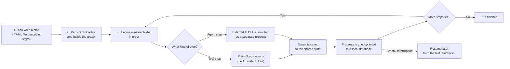

# Kern-Orch

**Kern-Orch is a tool that runs AI agents as a team, following a plan you draw as a diagram.**

Instead of calling one AI model and hoping for the best, Kern-Orch lets you describe a
step-by-step workflow — a "graph" — where each step is either:

- a small piece of code that does one deterministic thing (no AI involved), or
- an AI agent that gets a task and produces an answer.

Kern-Orch then executes that workflow for you: it runs the steps in the right order, passes
information from one step to the next, and — if something crashes halfway through — lets you
pick up exactly where it left off instead of starting over.

## Why this exists

AI agents are unreliable on their own: they can get stuck, go off-script, or lose track of
what they were doing on a long task. Kern-Orch's job is to keep them on rails:

- **You control the plan, not the AI.** The order of steps and the rules for what happens
  next ("if the agent says X, go here; otherwise go there") are written in plain configuration
  files, not left to the AI to decide.
- **The AI never runs "loose."** Kern-Orch never talks to an AI model directly inside its own
  code. It hands off each AI step to a separate, external program built specifically for that
  (a "provider CLI"), waits for the result, and continues the plan. This keeps AI calls
  contained and swappable.
- **Nothing is lost on failure.** Every step is saved to a local database as it happens. If
  the process is interrupted, you can resume the exact same run later.
- **Long tasks don't spiral.** An agent's working memory can be reset on purpose ("freeze")
  partway through a run, so it doesn't get bloated with old context and drift off task.

## The building blocks

| Concept | In plain words |
|---|---|
| **Graph** | The overall plan: a set of steps and the connections between them. |
| **Node** | One step in the plan. It's either a **tool** (plain code, no AI) or an **agent** (a task handed to an AI model). |
| **State** | The shared notebook that gets passed from step to step, so each one can read what happened before and add its own results. |
| **Edge** | The arrow between two steps — it can be fixed ("always go here next") or conditional ("go here only if the state says so"). |
| **Sub-graph** | A whole mini-plan nested inside a single step, useful for a self-contained sub-task. |
| **Checkpoint** | A saved snapshot of progress, written after each step, so a run can be resumed after a crash. |
| **Freeze** | Wiping an agent's short-term working memory on purpose, while keeping the important results, to stop long runs from becoming a mess. |

## How a run flows



The key idea: **the harness decides what happens next, the AI only does the thinking it's
asked to do for one step at a time.**

## Getting started

```bash
go build ./...
go run . run examples/hello.yaml
```

This runs a minimal example graph with no setup required — if no external AI CLI is
configured, Kern-Orch uses a built-in stand-in so you can see the whole flow working end to
end. To use a real AI provider for the agent steps, set the `KERN_AGENT_CLI` environment
variable to point at that provider's command-line tool.

Other useful commands:

```bash
go run . status              # see the state of past runs
go run . resume <run-id>      # continue a run after an interruption
go run . list-skills          # see what tools/agents are registered
```

## Connection contracts

Every `kern-*` brick publishes what it accepts and states what it needs. Nothing else is
part of the contract: internal packages, the checkpoint schema and the SQLite file may
change without notice. **kern-orch depends on no other brick** — it exposes and consumes
contracts, never internals.

### Consumed — provider CLI (`kern-link`)

kern-orch never calls an LLM itself. Each `agent` node spawns the binary named by
`KERN_AGENT_CLI` and speaks JSON-lines over its standard streams. Unset the variable and a
deterministic stub takes over, so the harness runs with nothing configured.

> **Status: provisional.** This protocol is specified in `internal/agentrunner/protocol.go`
> and awaits reconciliation with the real CLI. Treat it as a draft, not a stable contract.

kern-orch writes exactly one request object to the child's stdin, then closes it:

```json
{"node_id":"think","prompt":"Do some work","state":{"…":"…"}}
```

The child streams events back on stdout, one JSON object per line:

```json
{"type":"token","text":"…"}      // incremental output, forwarded to the token sink
{"type":"result","output":{…}}   // final; output is merged into the shared state
{"type":"error","message":"…"}   // aborts the run
```

The last `result` wins. A non-zero exit with no result is an error.

### Emitted — step transitions

When `KERN_STEP_REPORT_URL` is set, kern-orch POSTs one event per completed graph level to
that URL. Unset, it emits nothing and behaves exactly as before.

The URL is the whole contract: kern-orch knows nothing of the sink's route shape, and the
sink needs no knowledge of kern-orch beyond the schema below. Today's consumer is
[`kern-ui`](../Kern-UI/README.md).

#### `StepEvent` — contract `kern.step-event/v2`

<!-- CANONICAL BLOCK — mirrored verbatim in Kern-UI/README.md and Kern-Orch/README.md.
     Drift is caught by tests, not by discipline: the same payloads live in
     contracts/kern.step-event.v2*.json in both repos, and each side asserts against them on
     every CI run — kern-orch that its reporter emits exactly this, kern-ui that its
     ingestion accepts exactly this. Change the contract and both suites go red. -->

```json
{
  "run_id": "a23ead5373d9b746",
  "graph": "hello",
  "step": 2,
  "frontier": ["synthese", "critique"],
  "state": { "echo": "..." },
  "at": "2026-07-26T12:00:02Z",
  "topology": {
    "entry": "greet",
    "nodes": [{ "id": "greet", "kind": "agent", "skill": "planner" }],
    "edges": [{ "from": "greet", "to": ["synthese"] }]
  }
}
```

| Field | Type | Required | Meaning |
|---|---|---|---|
| `run_id` | string | yes | Identifies the run. |
| `graph` | string | yes | Human label for the run, shown by the consumer. |
| `step` | int >= 0 | yes | Level counter, increases within a run. |
| `frontier` | string[] | yes | The nodes to execute **next**. An empty list means the run is over. |
| `state` | object | no | Flat business data. Never a producer's internal envelope. |
| `at` | RFC 3339 | yes | When the level completed. |
| `topology` | object | no | The graph's shape. Sent **once**, on the run's first event. |
| `topology.entry` | string | yes | Entry node id. Never appears in a frontier — it ran first. |
| `topology.nodes[]` | object | yes | `id` and `kind` (`tool` / `agent` / `subgraph`), plus `skill` on an agent node. |
| `topology.nodes[].skill` | string | no | The catalogue entry backing the node, as declared by `skill:` in the YAML. **Not the id** — a node `greet` may run the skill `planner`, so matching the two by name would be a guess. Absent on tool nodes, which name a Go function. |
| `topology.edges[]` | object | no | `from`, `to[]`, or `dynamic: true` when a router picks the targets at run time. |
| `error` | object | no | Set on the terminal event of a run that failed; `message` is required. |

kern-orch fills `graph` with the topology file name minus its extension, and `state`
through `State.Keys()`/`Get()` — the wire form of `graph.State` (zones, freeze counter)
deliberately stays inside kern-orch.

**What a sink must accept**

- **Replays.** The same step may arrive twice; a sink must be idempotent.
- **`frontier: []`** as the end-of-run marker, not a missing field.

**What kern-orch guarantees**

- **Reporting never fails a run.** Whatever the sink answers — 500, timeout, unreachable
  host, malformed URL — the graph keeps going and the error goes to stderr.
- **One POST per level, in order**, synchronous, capped at 2 s each.
- Granularity is the level, not the node: `Engine.OnStep` fires after a whole frontier
  completes.

### Emitted — skills catalogue

When `KERN_REGISTRY_REPORT_URL` is set, kern-orch POSTs its whole skills registry to that
URL: once at the start of every `run`, and on demand via `kern-orch publish-skills`. Unset,
it publishes nothing.

It is a second variable rather than a route derived from `KERN_STEP_REPORT_URL`, for the
reason stated above: the URL is the whole contract, so kern-orch must not invent a sibling
path on a host it knows nothing about.

#### `Catalogue` — contract `kern.registry/v1`

<!-- CANONICAL BLOCK — mirrored verbatim in Kern-UI/README.md and Kern-Orch/README.md.
     Drift is caught by tests, not by discipline: the same payload lives in
     contracts/kern.registry.v1.json in both repos, and each side asserts against it on
     every CI run — kern-orch that its publisher emits exactly this, kern-ui that its
     ingestion accepts exactly this. Change the contract and both suites go red. -->

```json
{
  "source": "kern-orch",
  "at": "2026-07-27T12:00:00Z",
  "skills": [
    { "name": "Analyse", "kind": "tool", "description": "Décompose une demande." },
    { "name": "Scribe", "kind": "agent", "description": "Rédige et reformule." }
  ]
}
```

| Field | Type | Required | Meaning |
|---|---|---|---|
| `source` | string | yes | Which brick published this catalogue. |
| `at` | RFC 3339 | yes | When it was read. |
| `skills[]` | array | yes | Every skill the producer holds. May be empty. |
| `skills[].name` | string | yes | The key. kern-orch already indexes its registry by name, so no second identifier was invented for the wire. |
| `skills[].kind` | string | yes | `tool` or `agent` — the `type:` of the SKILL.md frontmatter. |
| `skills[].description` | string | no | The frontmatter `description`, one line. |

**What kern-orch guarantees**

- **The catalogue is whole.** Each publication replaces the previous one; a skill removed
  from disk disappears downstream on the next publication.
- **Sorted by name**, so a sink never has to sort.
- **Publishing never fails a run**, exactly like step reporting: a broken sink costs a line
  on stderr and nothing else.

**What deliberately does not travel.** A skill's directory — a filesystem path is an
internal, not a contract. Its SKILL.md body. Any "wired" flag — a loaded skill is by
definition available, so the field would read true on every row.

### Asked for, not yet emitted

Topology, failure and the skills registry have all shipped. One thing is still asked for:

| What | Where it would live | Why kern-ui needs it |
|---|---|---|
| Tool invocation and readback | `internal/tools` | A consumer can list the wired tools but cannot ask any of them for a display value |

Stated in full, with the other bricks' contracts, in
[`../Kern-UI/docs/expected-contracts.md`](../Kern-UI/docs/expected-contracts.md).

### Not yet defined

`kern-pilot` (steering), `kern-obs` (observability), `kern-policy`, `kern-guard`,
`kern-memory` — see [`docs/ROADMAP.md`](docs/ROADMAP.md). None of them has a contract yet;
kern-orch exposes no endpoint for them today.

## Project layout

- `internal/graph` — the core engine: steps, connections, shared state, execution order.
- `internal/agentrunner` — the bridge to the external AI command-line tool.
- `internal/checkpoint` — saves progress so runs can be resumed.
- `internal/skills` — the catalog of available tools and agents.
- `internal/topology` — turns a YAML plan file into a runnable graph.
- `internal/cmd` — the command-line interface (`run`, `resume`, `status`, `list-skills`).
- `examples/` — sample graphs you can run right away.
- `docs/` — architecture diagrams, roadmap, and glossary for a deeper dive.

## Learn more

- [`docs/ARCHITECTURE.md`](docs/ARCHITECTURE.md) — detailed diagrams of how the pieces fit
  together.
- [`docs/GLOSSAIRE.md`](docs/GLOSSAIRE.md) — full glossary of terms used across the project.
- [`docs/ROADMAP.md`](docs/ROADMAP.md) — what's built, what's planned.
