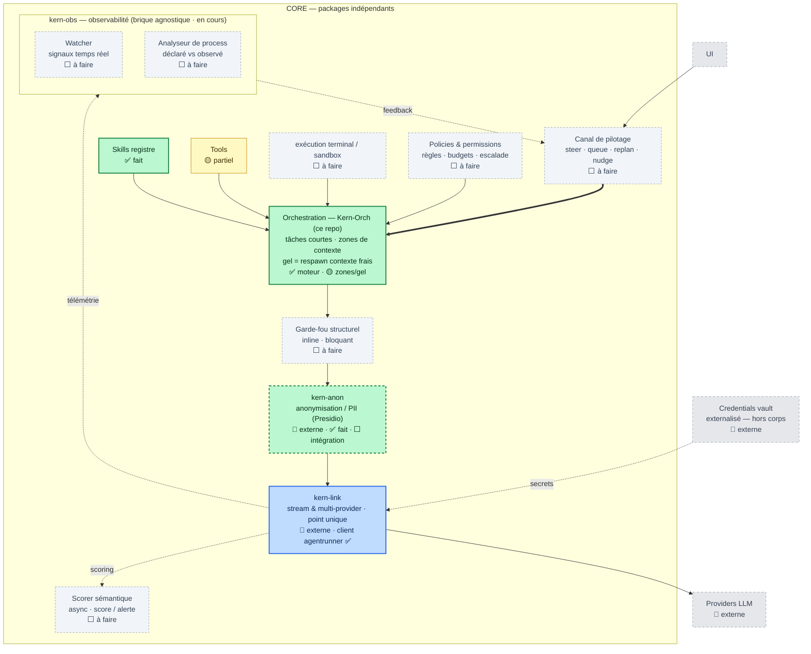

# Kern-Orch — Cartographie & épics par module

> Situe **Kern-Orch** (ce repo) dans l'écosystème cible « Kern » et détaille le travail
> restant, module par module, pour s'organiser. Dernière mise à jour : 2026-07-22.

## Principe : des briques autonomes et agnostiques

Chaque boîte de la carte est une **brique `kern-*` autonome et agnostique** — un module à part
entière (repo/déployable propre), composable via des **contrats standards**, jamais du code
enfoui dans une autre brique. Une brique ne dépend pas des internes d'une autre : elles se
parlent par des frontières neutres (subprocess/JSON-lines pour kern-link, OTLP/GenAI pour
kern-obs, etc.).

La famille (noms) :

| Brique | Rôle | Statut |
|---|---|---|
| **kern-orch** | orchestration (ce repo) | ✅ moteur |
| **kern-anon** | anonymisation / PII (Presidio) | 🔌 externe · faite |
| **kern-link** | passage LLM multi-provider (point unique) | 🔌 externe · client fait |
| **kern-obs** | observabilité agnostique | ⬜ module à part · en cours |
| *(à venir)* | pilotage · policies · garde-fou · sandbox · scorer | ⬜ |

## Où se situe ce repo

Kern-Orch est la brique **Orchestration** du CORE, plus ce qu'elle porte directement (Skills,
Tools, et le *client* de kern-link). Les autres briques de contrôle sont des modules `kern-*`
séparés : certaines déjà faites (kern-anon, kern-link) à **câbler** par contrat, les autres à
créer. **kern-orch ne dépend d'aucune** ; il expose/consomme des contrats.

**Légende de statut**
- ✅ **fait** — présent et testé dans ce repo
- 🟡 **partiel** — amorcé, incomplet
- ⬜ **à faire** — pas commencé
- 🔌 **externe** — brique `kern-*` séparée / dépendance (hors de ce repo)

## Cartographie (mermaid)

---

## Épics par module

Chaque module = un épic. Taille indicative : **S** (~jours), **M** (~1–2 semaines),
**L** (~3 semaines +). Les dépendances pointent vers ce qui doit exister avant.

### ✅ EPIC-01 · Orchestration (moteur) — *ce repo, fait à 90 %*
Rôle : possède le graphe, le state, le routage, les checkpoints. Cœur agnostique métier.
- [x] State partagé sérialisable, Node (tool/agent/subgraph), edges Go-purs, fan-out
- [x] Checkpoints SQLite + reprise (`resume`)
- [x] Sous-graphes / sous-agents
- [ ] 🟡 **Zones de contexte & « gel = respawn contexte frais »** — aujourd'hui on a un state
  générique + state enfant frais par sous-graphe, mais pas de notion explicite de *zone de
  contexte* ni de *gel → respawn d'un contexte neuf* pour un agent long. **Taille : M**
- [ ] Persistance du chemin YAML dans le checkpoint (pour un `resume <run-id>` sans re-fournir le graphe). **S**
- Dépendances : aucune.

### ✅ EPIC-02 · Skills registre — *fait*
Rôle : catalogue des capacités (SKILL.md, `type: tool|agent`).
- [x] Load frontmatter, `list-skills`
- [ ] Lien registre ↔ exécution : qu'un `type: tool` soit **exécutable** sans redéclarer une func Go par nom (fusionner catalogue et `topology.Registry`). **M** — *voir EPIC-03*
- Dépendances : aucune.

### 🟡 EPIC-03 · Tools — *partiel*
Rôle : bibliothèque de tools invoqués par un agent, consommés aussi par l'UI/MCP/API.
- [x] `topology.Registry` (funcs tool/router par nom) + builtins de démo
- [ ] Format de tool réutilisable (schéma d'entrée/sortie, validation) **M**
- [ ] Chargement de tools depuis les skills (`type: tool`) **M**
- [ ] Exposition MCP/API des tools (un service unique, zéro duplication) **L**
- Dépendances : EPIC-02.

### ⬜ EPIC-04 · exécution terminal / sandbox
Rôle : exécuter des tools/commandes dans un bac à sable (isolation, timeouts, quotas).
- [ ] Runner sandboxé (process isolé, cwd/env contrôlés, timeout) **M**
- [ ] Politique de ressources (CPU/mém/FS/réseau) **L**
- [ ] Intégration comme type de nœud/tool **S**
- Dépendances : EPIC-03, EPIC-06 (policies).

### ⬜ EPIC-05 · Canal de pilotage (steering)
Rôle : piloter un run en cours — `steer · queue · replan · nudge` (human/agent-in-the-loop).
- [ ] Boucle de contrôle : file d'instructions injectables dans un run vivant **L**
- [ ] `replan` (réécrire la frontière/graphe en cours) + `nudge` **L**
- [ ] Reçoit le feedback de l'observation (flèche retour de la carte) **M**
- Dépendances : EPIC-01, EPIC-11 (observation).

### ⬜ EPIC-06 · Policies & permissions
Rôle : règles, budgets, escalade — **sans secrets** (les secrets = vault externe).
- [ ] Modèle de règles (qui peut quel tool/skill, budgets de tokens/temps) **M**
- [ ] Point d'application avant orchestration (la flèche Policies → Orchestration) **M**
- [ ] Escalade / approbations **M**
- Dépendances : EPIC-01.

### ⬜ EPIC-07 · Garde-fou structurel (inline, bloquant)
Rôle : validation **bloquante** en ligne entre Orchestration et données (schémas, invariants).
- [x] Embryon : `Graph.Validate` (topologie)
- [ ] Garde-fous runtime sur le state/sorties (schémas, contraintes métier), bloquants **M**
- Dépendances : EPIC-01.

### 🔌 EPIC-08 · kern-anon (PII/Presidio) — *brique externe faite, intégration à faire*
Rôle : pseudonymisation par ID avant l'appel LLM ; ré-hydratation au retour. Brique `kern-*`
autonome et agnostique — kern-orch ne fait que la câbler par contrat.
- [x] 🔌 Brique de pseudonymisation (Presidio) — **externe, fonctionnelle**
- [ ] Définir le contrat d'intégration (I/O de la brique) **S**
- [ ] Câblage côté kern-orch : pseudonymiser à l'aller / ré-hydrater au retour, autour de
  kern-link (juste avant/après l'`agentrunner`) **M**
- Dépendances : EPIC-01 ; positionné juste avant kern-link ; accès à la brique kern-anon.

### 🔌 EPIC-09 · kern-link (client) — *externe, client fait*
Rôle : point de passage unique vers les providers (stream & multi-provider). La brique
elle-même est **externe** (repo du collègue).
- [x] Client subprocess (`agentrunner.Subprocess`) + Stub + protocole JSON-lines **provisoire**
- [ ] **Réconcilier le contrat §6.4** avec la vraie CLI dès accès **M** *(bloquant externe)*
- Dépendances : accès au repo kern-link.

### ⬜ EPIC-10 · Scorer sémantique (async)
Rôle : scorer les échanges (qualité/dérive) en asynchrone, émettre des alertes.
- [ ] Hook async sur kern-link (télémétrie) → score **M**
- [ ] Seuils & alertes **S**
- Dépendances : EPIC-09, EPIC-11.

### EPIC-11 · Observabilité — deux moitiés distinctes
**Décision** : **OpenTelemetry (conventions GenAI)** comme frontière neutre ; **LangSmith écarté**
(propriétaire, non souverain, Python/JS-first, cher). → voir `OBSERVABILITY.md`. À séparer
strictement en deux :

**11a — côté kern-orch (émission, DANS ce repo) — S–M**
Fine couche : émettre, sans aucune dépendance vers kern-obs.
- [x] Embryon : checkpoints + `status`
- [ ] Span racine par run (trace = runID), span par nœud (hook `StepFunc`), span `gen_ai.*`
  par appel LLM (`agentrunner`) **S–M**
- [ ] Émettre le **plan déclaré** comme attributs de télémétrie (nœuds/edges attendus), pour
  que le « déclaré vs observé » reste faisable **sans** lire l'intérieur de kern-orch **S**
- [ ] Exporter OTLP pluggable via env (défaut off = no-op, comme le Stub) **S**
- Dépendances : EPIC-01 ; épingler une version des semconv GenAI (statut « Development »).

**11b — 🧱 kern-obs (brique autonome, HORS de ce repo) — module à part**
Agnostique : ingère l'OTLP/GenAI de **n'importe quelle** brique `kern-*`, pas seulement kern-orch.
- [ ] Ingestion OTLP + stockage (peut s'appuyer en interne sur Langfuse/Phoenix) **M**
- [ ] Watcher temps réel (flux de spans) **M**
- [ ] Analyseur « déclaré vs observé » (plan émis vs trace réelle) — **valeur ajoutée** **M–L**
- [ ] Boucle de feedback vers kern-pilot (le Canal de pilotage) **M**
- Frontière : **OTLP uniquement**. kern-obs ne connaît jamais le code de kern-orch.
  Alimente le futur kern-scorer (mêmes spans). *(roadmap propre au repo kern-obs)*

### 🔌 EPIC-12 · Briques externes
- UI, Credentials vault (hors corps), Providers LLM — hors de ce repo. Contrats
  d'intégration à définir (surtout vault → kern-link).

---

## Ordre suggéré (jalons)

1. **Consolider le CORE** (déjà là) : finir EPIC-01 (zones/gel, resume+YAML) et EPIC-03 (tools).
2. **Sécuriser le flux** : EPIC-06 (policies) → EPIC-07 (garde-fou) → EPIC-08 (câbler la PII
   externe) — c'est la colonne verticale Orchestration → … → kern-link de la carte.
3. **Boucler kern-link** : EPIC-09 dès l'accès à la brique du collègue.
4. **Contrôle & feedback** : EPIC-11 (observation) puis EPIC-05 (pilotage) et EPIC-10 (scorer).
5. **Isolation d'exécution** : EPIC-04 (sandbox) quand les policies existent.

> Estimation grossière du reste (hors externes) : ~**7–9 semaines** de travail à un dev,
> dominées par pilotage (L), observation/analyseur (L) et l'exposition tools (L). La PII est
> désormais externe (reste l'intégration, M) et non plus un développement complet.
